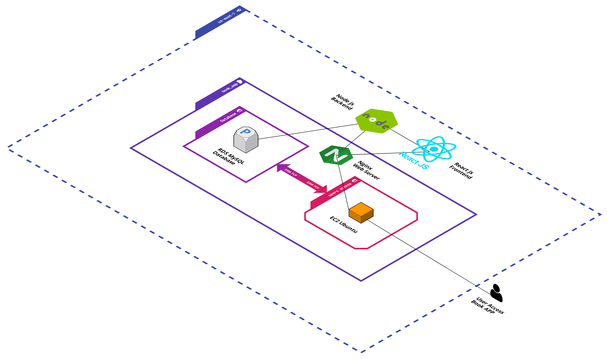

# Books_app

This is a web application for managing books, featuring CRUD operations, built using React, Node.js, Nginx, and MySQL. Follow the steps below to set up the application on an AWS EC2 instance rds mysql.

# Architecture 



# Prerequisites

- Set up an AWS EC2 instance with AmazonLinux or Ubuntu.
- Install Node.js, Git, and Nginx on the EC2 instance.

## Installation

1. Clone this repository on the EC2 instance:

```bash
git clone https://github.com/mr3xplorer/Books_app.git
```

## Frontend Setup

1. Navigate to the client directory:

```bash
cd client
```

2. Install dependencies:

```bash
npm install
```

3. Start the frontend server:

```bash
npm start
```

## Backend Setup

1. Navigate to the backend directory:

```bash
cd backend
```

2. Install dependencies:

```bash
npm install
```

3. Start the backend server:

```bash
node index.js
```

## Connecting Frontend to Backend

In the client code:

- Replace `<ec2_ip>` with your EC2 instance's IP address in the following files:
  - `src/pages/Add.jsx`
  - `src/pages/Books.jsx`
  - `src/pages/Update.jsx`

## Deployment with Nginx

1. Start Nginx:

```bash
sudo systemctl start nginx.service
sudo systemctl enable nginx.service
```

2. Set up React app in Nginx:

```bash
sudo rm -rf /usr/share/nginx/html/*
sudo cp -r /home/ec2-user/client/build/* /usr/share/nginx/html
```

3. Start the backend server:

```bash
cd /home/ec2-user/backend
node index.js
```

## Accessing the Application

- The client runs at `<ec2_ip>:3000`.
- The backend runs at `<ec2_ip>:8800`.
- Ensure to set `<ec2_ip>:8800` as the path in React to connect the backend to the frontend.

## Repository Structure

- **client**: Frontend codebase.
- **backend**: Backend codebase.
- **<ec2_ip>**: Replace with your EC2 instance's IP address.

Feel free to further customize and enhance this application according to your requirements.
